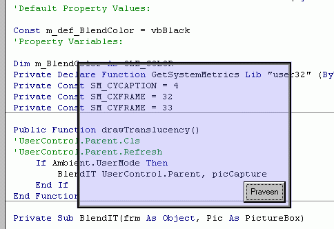

## Translucency OCX V1

### Description

Create Translucency to your forms.. by a single line of code.....
 
### More Info
 

             |
---                |---
**Submitted On**   |2002-03-17 13:59:46
**By**             |[PraveenMenon](https://github.com/Planet-Source-Code/PSCIndex/blob/master/ByAuthor/praveenmenon.md)
**Level**          |Beginner
**User Rating**    |4.4 (48 globes from 11 users)
**Compatibility**  |VB 6\.0
**Category**       |[Custom Controls/ Forms/  Menus](https://github.com/Planet-Source-Code/PSCIndex/blob/master/ByCategory/custom-controls-forms-menus__1-4.md)
**World**          |[Visual Basic](https://github.com/Planet-Source-Code/PSCIndex/blob/master/ByWorld/visual-basic.md)
**Archive File**   |[Translucen627923172002\.zip](https://github.com/Planet-Source-Code/praveenmenon-translucency-ocx-v1__1-32762/archive/master.zip)

